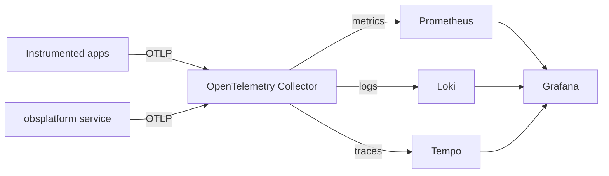

# Enterprise Observability Platform

A vendor-neutral observability platform that ingests metrics, logs, and traces
via OpenTelemetry and routes them to Prometheus, Loki, and Tempo, unified in
Grafana.

[](LICENSE)
[](https://github.com/abhisheksawant52/enterprise-observability-platform/actions/workflows/ci.yml)
[](https://www.python.org/)
[](https://github.com/psf/black)

## Overview

Observability is only useful when the three signals — metrics, logs, and
traces — arrive through a single, consistent pipeline and can be correlated
after the fact. This platform provides that pipeline: applications emit
OpenTelemetry data over OTLP, an OpenTelemetry Collector normalises and batches
it, and each signal is exported to the backend built for it.

At the centre is `obsplatform`, a small FastAPI service. It exposes liveness,
readiness, and Prometheus metrics endpoints, configures structured JSON logging
suitable for shipping to Loki, and registers OpenTelemetry tracer and meter
providers wired to OTLP exporters on startup.

The project is aimed at platform and SRE teams who want a reproducible,
code-first observability stack they can deploy with Helm or plain Kubernetes
manifests, with the Collector configuration generated from the same source of
truth the service uses.

## Architecture



Components:

- **`obsplatform` service** — FastAPI app exposing `/health`, `/ready`, and
  `/metrics`; wires logging + OpenTelemetry on startup.
- **OpenTelemetry Collector** — OTLP receivers, `memory_limiter` + `batch`
  processors, and exporters to Prometheus, Loki, and Tempo.
- **Prometheus / Loki / Tempo** — backends for metrics, logs, and traces.
- **Grafana** — unified query and dashboards, with datasources provisioned
  from `deploy/grafana/datasources.yaml`.

See [docs/architecture.md](docs/architecture.md) for a deeper write-up.

## Features

- FastAPI service with liveness (`/health`), readiness (`/ready`), and
  Prometheus (`/metrics`) endpoints.
- OpenTelemetry tracing and metrics providers with OTLP exporters.
- Structured JSON logging via structlog, ready for Loki.
- Typed pipeline model and registry that generates the Collector config, so
  code and deployed configuration stay in sync.
- Deployment assets for the full stack: Collector, Prometheus, Grafana
  datasources, a Helm chart, and plain Kubernetes manifests.
- Multi-stage, non-root container image with a built-in healthcheck.
- Fully typed codebase with tests, ruff, black, and pre-commit.

## Tech Stack

Python 3.11+ · FastAPI · Uvicorn · Pydantic / pydantic-settings ·
OpenTelemetry SDK · prometheus-client · structlog · Prometheus · Loki · Tempo ·
Grafana · Docker · Helm · Kubernetes · GitHub Actions

## Getting Started

### Prerequisites

- Python 3.11 or newer
- `make` (optional, for convenience targets)
- Docker and Helm (optional, for building and deploying)

### Install

```bash
python -m venv .venv && source .venv/bin/activate
make install            # pip install -e ".[dev]"
```

### Run

```bash
# Copy and adjust configuration
cp .env.example .env

# Start the service (console script defined in pyproject.toml)
obs-platform
# or, equivalently
python -m obsplatform.main
```

Then check the endpoints:

```bash
curl http://localhost:8000/health
curl http://localhost:8000/ready
curl http://localhost:8000/metrics
```

### Develop

```bash
make lint     # ruff + black --check
make format   # ruff --fix + black
make test     # pytest
make build    # docker build -t ghcr.io/abhisheksawant52/enterprise-observability-platform:latest .
```

## Project Structure

```
.
├── src/obsplatform/
│   ├── __init__.py           # package version
│   ├── config.py             # OBS_-prefixed pydantic settings
│   ├── logging_config.py     # structlog JSON logging
│   ├── telemetry.py          # OpenTelemetry tracer/meter providers
│   ├── pipelines.py          # signal pipeline model + registry
│   ├── collector.py          # OTel Collector config generator
│   └── main.py               # FastAPI app + run() entrypoint
├── tests/                    # pytest suite (endpoints + collector)
├── deploy/
│   ├── otel-collector-config.yaml
│   ├── prometheus/prometheus.yml
│   ├── grafana/datasources.yaml
│   ├── helm/observability-platform/   # Helm chart
│   └── k8s/                  # plain manifests
├── docs/architecture.md
├── Dockerfile
├── pyproject.toml
└── .github/workflows/ci.yml
```

## Configuration

All settings are read from `OBS_`-prefixed environment variables (or a `.env`
file) by `obsplatform.config.Settings`. See [.env.example](.env.example).

| Variable               | Default                                 | Description                              |
| ---------------------- | --------------------------------------- | ---------------------------------------- |
| `OBS_SERVICE_NAME`     | `observability-platform`                | `service.name` resource attribute.       |
| `OBS_ENV`              | `dev`                                   | Deployment environment label.            |
| `OBS_LOG_LEVEL`        | `INFO`                                  | Root log level.                          |
| `OBS_HOST`             | `0.0.0.0`                               | HTTP bind address.                       |
| `OBS_PORT`             | `8000`                                  | HTTP port.                               |
| `OBS_OTLP_ENDPOINT`    | `http://otel-collector:4317`            | OTLP gRPC endpoint of the Collector.     |
| `OBS_PROMETHEUS_PORT`  | `9464`                                  | Collector Prometheus exporter port.      |
| `OBS_LOKI_ENDPOINT`    | `http://loki:3100/loki/api/v1/push`     | Loki push API endpoint.                  |
| `OBS_TEMPO_ENDPOINT`   | `http://tempo:4317`                     | Tempo OTLP endpoint.                     |

## Deployment

Both deployment paths use the image
`ghcr.io/abhisheksawant52/enterprise-observability-platform` on port `8000`.

```bash
# Helm
helm install obs deploy/helm/observability-platform \
  --namespace observability --create-namespace

# Plain manifests
kubectl apply -f deploy/k8s/namespace.yaml
kubectl apply -f deploy/k8s/
```

Deploy the supporting stack with the Collector config
(`deploy/otel-collector-config.yaml`), Prometheus scrape config
(`deploy/prometheus/prometheus.yml`), and Grafana datasource provisioning
(`deploy/grafana/datasources.yaml`).

## Contributing

Contributions are welcome — see [CONTRIBUTING.md](CONTRIBUTING.md) and our
[Code of Conduct](CODE_OF_CONDUCT.md).

## Security

Please report vulnerabilities as described in [SECURITY.md](SECURITY.md).

## License

Released under the [MIT License](LICENSE).
