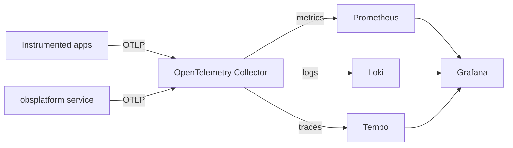

# Architecture

The enterprise observability platform provides a single, vendor-neutral
ingestion path for the three pillars of observability — metrics, logs, and
traces — and routes each signal to a purpose-built backend.

## Signal flow

## Components

- **`obsplatform` service** — a FastAPI application that exposes
  `/health`, `/ready`, and `/metrics`. On startup it configures structured
  JSON logging and registers OpenTelemetry tracer and meter providers wired to
  OTLP exporters (`obsplatform.telemetry`).
- **OpenTelemetry Collector** — receives OTLP over gRPC (`:4317`) and HTTP
  (`:4318`), applies `memory_limiter` and `batch` processors, and exports to
  the three backends. Its configuration is generated by
  `obsplatform.collector` and mirrored in `deploy/otel-collector-config.yaml`.
- **Prometheus** — scrapes metrics from the service `:8000/metrics` and the
  collector `:9464/metrics` (`deploy/prometheus/prometheus.yml`).
- **Loki** — stores logs pushed by the collector.
- **Tempo** — stores traces exported by the collector over OTLP.
- **Grafana** — single pane of glass; datasources for Prometheus, Loki, and
  Tempo are provisioned from `deploy/grafana/datasources.yaml`, with
  trace-to-logs and trace-to-metrics correlation enabled.

## Pipelines

Each signal is modelled as a `Pipeline` (`obsplatform.pipelines`) with an
ordered list of receivers, processors, and exporters. The `PipelineRegistry`
is the single source of truth used to render the collector configuration,
keeping the code and the deployed config consistent.

## Configuration

All runtime configuration is supplied through `OBS_`-prefixed environment
variables loaded by `obsplatform.config.Settings` (pydantic-settings). See
`.env.example` for the complete list. In Kubernetes these values are delivered
through a `ConfigMap` (Helm) or inline `env` entries (plain manifests).

## Deployment

The platform ships both a Helm chart
(`deploy/helm/observability-platform`) and plain Kubernetes manifests
(`deploy/k8s`). Both use the image
`ghcr.io/abhisheksawant52/enterprise-observability-platform` on port `8000`,
run as a non-root user, and define liveness (`/health`) and readiness
(`/ready`) probes.
